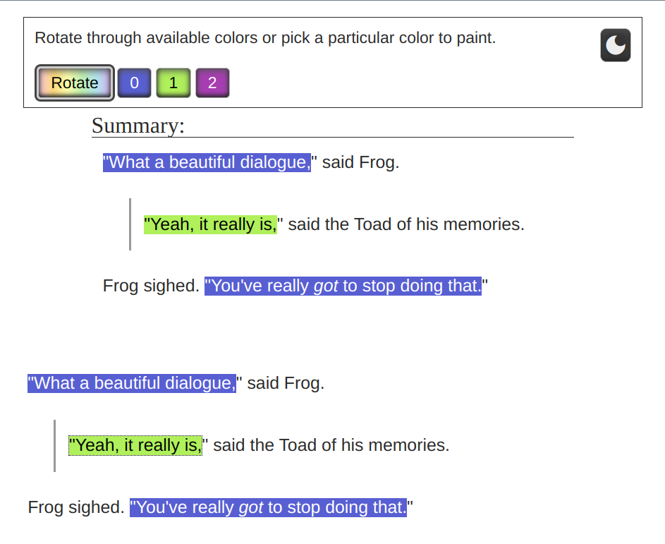

# AO3 scriptify

Color-code dialogue on AO3 to turn a fic into a script.

With any of Tampermonkey/Greasemonkey/Violentmonkey/etc installed in your browser, [click here to install AO3-scriptify](https://github.com/irrationalpie7/AO3-scriptify/raw/main/scriptify.pub.user.js).

## Using the extension
With the script installed, a new "Scriptify:" section will be added below the AO3 work stats. The work will look the same as usual until you hit the "Start color-coding dialogue" button.

Once you do, the "Start color-coding dialogue" button will be replaced with an "Export" button, below which there will be a warning not to refresh the page and some exporting info.

Currently:
> Warning: once you start color-coding dialogue, refreshing the page will ruin all your hard work! If copy/paste doesn't work or is too messy, use the export button. You can look at the resulting file in any browser, or upload it to google drive and then open it as a doc.

Additionally, a panel will appear with buttons for each of the currently in-use dialogue colors, plus one. This controls the behavior when you click on a line of dialogue. If you select a numbered button, then each time you click a line of dialogue it will set the line of dialogue's color to match that button. If instead the "Rotate" button is selected, clicking on a line of dialogue will cycle through each of the currently available colors. Initially, all lines of dialogue are the same color as the "0" button (dark blue). If you color any to match the "1" button (bright green), then unless you click that line back to match "0", the next time you change a dialogue line's color, a new color option will appear, first "2", then "3", etc. The list goes up to "14", for a total of 15 colors.

If you don't like the background color of the control panel, you can use the button in the top right of the control panel to switch between light and dark mode. Light mode is designed to fit with the default AO3 site skin, and dark mode to fit with the Reversi site skin.

Here we can see the extension in use. The control panel floats at the top of the screen, and the lines of dialogue of the test work have become highlighted (clickable) areas. Frog's lines are still in the initial dark blue color, but since Toad's lines have been colored green, a new color option has appeared.
